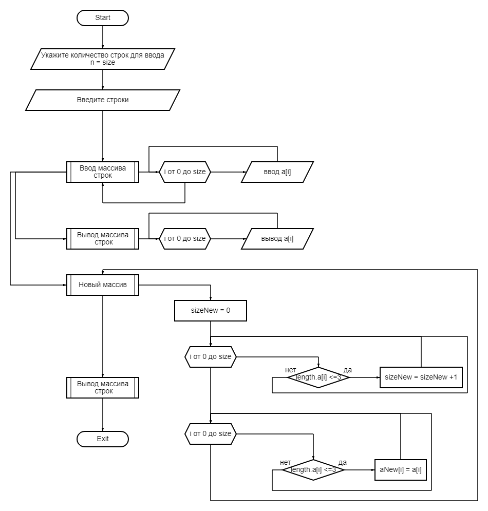

# Задача:
_Программа решает следующую задачу :_

Написать программу, которая из имеющегося массива строк  формирует массив из строк, длина которых меньше либо равна 3 символа. Первоначальный массив можно ввести с клавиатуры, либо задать на старте выполнения алгоритма. При решении не рекомендуется пользоваться коллекциями, лучше обойтись исключительно массивами

Пример: 

["hello", "2", "world", ":-)"] -> ["2", ":-)"] 

# Реализация: 
Порядок действий по блок - схеме:

1. Программа принимает на ввод количество строк (переменная _size_);
2. Программа принимает на ввод массив строк (через функцию _StringArray_);
3. Программа осуществялет вывод массива строк пользователю (через функцию _PrintArray_);
4. Формирует новый массив строк (через функцию _NewStringArray_). Для определения нового массива сначала определяется его размер (первый цикл проверка количества строк с числом символов <=3) далее запись этих строк в новый массив;
5. Выводит на консоль результат (через функцию _PrintArray_);

## _**Описание функций**_

__StringArray__

Функция _StringArray_ через цикл _for_ записывает построчно элементы массива введенные пользователем.

Функция возвращает исходный массив строк.

__PrintArray__

Функция _PrintArray_ через цикл _for_ выводит элементы массива введенные пользователем в одну строку.

__NewStringArray__

Функция принимает на вход исходный массив строк и количество элементов исходного массива. Через цикл _for_ определяет количество строк _sizeNew_ с длинной <=3. Далее создает новый массив длинной  через второй цикл _for_ и заполняет его строками с длинной менее 3х символов из первого массива.

